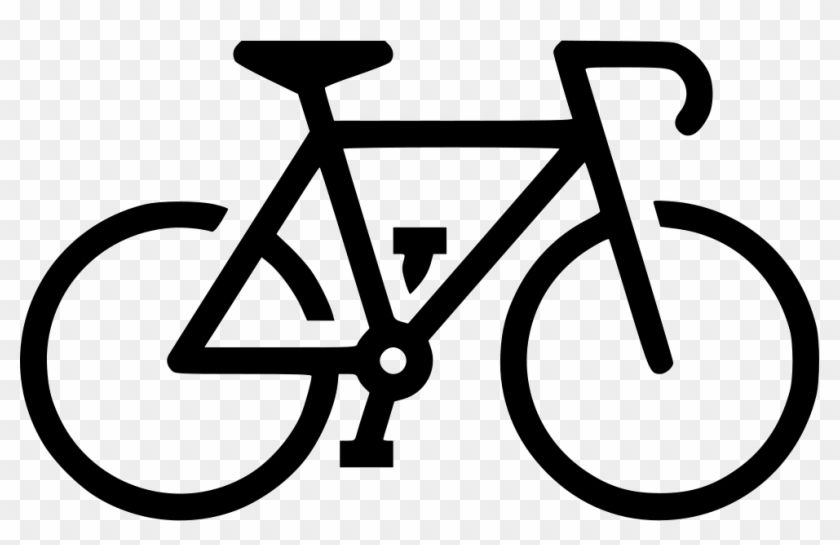

<h1 align="center">Bourdais Rémi</h1>

I'm an Artificial Intelligence and Big Data student at Telecom Nancy, currently in 4th. I'm interrested in immersive Web-application and cybersecurity. 
When I'm not coding, i'm probably ridding my bike somewhere.

 
<h2>A glimps of my tech stack</h2>

---

  
<h3><b>:bar_chart: &nbsp;My GitHub Statistics</b></h3>

   
    

        
    

    

         
    

